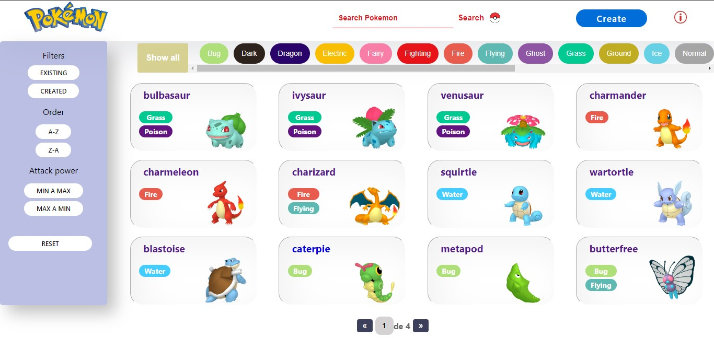

<h1 align="center">Hello World! 👋</h1>
<h2 align="center">I'm Dianeth Reyna! 👩🏻‍💻
</h2>

<div align="right">
<a href="https://www.linkedin.com/in/dianethreyna/">

 </a>
 <a href="https://www.instagram.com/dianreyna/">

 </a>
</div>


```txt
I am a Computer Systems Engineer, after dedicating myself to other areas,
in this year 2022 I discovered that my passion is programming and that is why
I decided to become a Full Stack Developer, I can easily adapt to learning new technologies,
I want to share my skills and knowledge with all of you.
```

**More About Me:**

<ul>
<li> 💬   Ask me about anything tech related, I am happy to help.</li>
<li>📫 Feel free to ping me on <a href="https://www.linkedin.com/in/dianethreyna/">LinkedIn.</a></li>
<li> 📝 Checkout my <a href="https://drive.google.com/file/d/1xZOZdYvSPl-83RqQ86kjF1TDTQARat19/view?usp=sharing">resume.</a></li>
<li> 🍃 when I'm free, I like to watch a series, go for a walk.</li>
</ul>

| Proyects                                                                   |                                                                                                                                                                                                                                                                                                                                                 |
| -------------------------------------------------------------------------- | ----------------------------------------------------------------------------------------------------------------------------------------------------------------------------------------------------------------------------------------------------------------------------------------------------------------------------------------------- |
| **PokeApp**                                                                |                                                                                                                                                                                                                                                                                                                                                 |
|    | <p align="left"> This individual project was carried out with the purpose of affirming and connecting the concepts learned in my training as a Full Stack developer at Henry Bootcamp. The idea was to create an application in which you can see the different pokemons, create a new pokemon, search for them, sort them and filter them.</p> |
| **HenryGift**                                                              | <a href="https://henry-gift.vercel.app/">Website</a>                                                                                                                                                                                                                                                                                            |
|  | <p align="left"> It is an application that starts from a traditional physical coupon book and we take it to the digital world so that users can easily access it, it was a group project that I did in Henry Bootcamp, it was carried out with the purpose of generating the experience of coding in a team adapting new technologies.</p>      |

<h4>📝 Tools, languages, and other things that I like to work with: </h4>

<div color="red">

</div>

| Front-End                                                                                        | Back-End                                                                                                                                  | DataBase                                                                                    | Tools                                                                                                    |
| ------------------------------------------------------------------------------------------------ | ----------------------------------------------------------------------------------------------------------------------------------------- | ------------------------------------------------------------------------------------------- | -------------------------------------------------------------------------------------------------------- |
|  JavaScript   |  NodeJs                                      |  PostgreSQL |  Git                        |
|  Vite             |  Sequelize                                       |                                                                                             |  GitHub       |
|  React            |  Express |                                                                                             |  Vs Code               |
|  Redux            |                                                                                                                                           |                                                                                             |  Adobe XD     |
|  Html5              |                                                                                                                                           |                                                                                             |  Illustraitor |
|  CSS3                |                                                                                                                                           |                                                                                             |  Drawio                |
|  Material-Ui  |                                                                                                                                           |                                                                                             |  Slack                   |
|  Boostrap |                                                                                                                                           |                                                                                             |  Ora             |

<!-- <div align="right">

### Connect with me

<a href="https://www.linkedin.com/in/dianethreyna/">

 </a>
 <a href="https://www.instagram.com/dianreyna/">

 </a>
</div> -->
